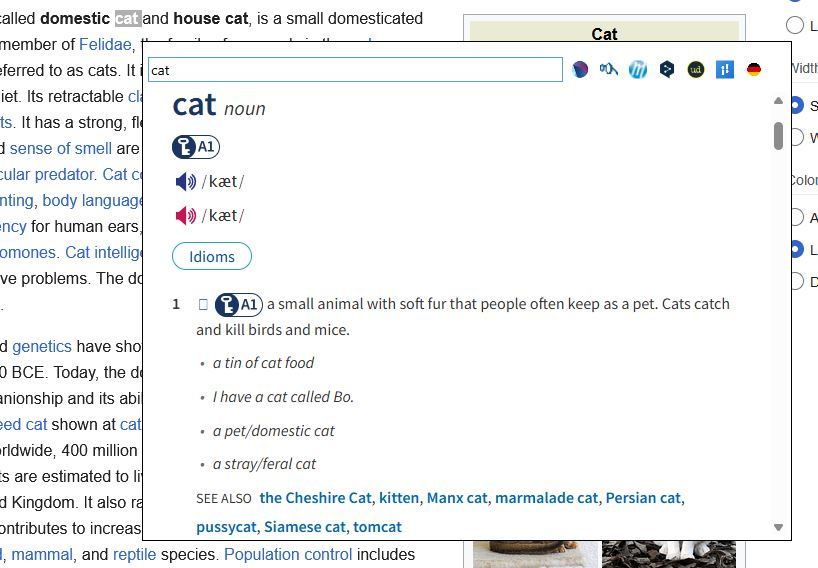

# Translator

A tray-resident pop-up dictionary for Windows. Copy a word, press <kbd>Ctrl</kbd>+<kbd>Space</kbd>,
and a small always-on-top window appears next to the cursor with that word already looked up.
Press <kbd>Esc</kbd> or click away and it disappears.

## Install

Download the latest `Translator-<version>-win-x64.zip` from
[Releases](../../releases), unzip it anywhere, and run `Translator.exe`.

## Usage

| Action | Result |
|---|---|
| <kbd>Ctrl</kbd>+<kbd>Space</kbd> | Look up the clipboard text at the cursor |
| <kbd>Enter</kbd> in the search box | Search with the first engine in the list |
| <kbd>Esc</kbd>, or clicking away | Hide the window |
| Toolbar icons | Re-run the current query against that engine |
| Tray icon | Translate, open the install folder, or exit |

## How it works

1. A system-wide hotkey is registered with `RegisterHotKey`.
2. On press, the clipboard is read.
3. If a full-screen application is in the foreground, the pop-up is suppressed unless that
   application is allow-listed — so it stays out of the way during games and presentations.
4. The text is formatted into the default engine's URL and loaded in an embedded WebView2 control.
5. Ad and tracker requests are blocked, and a per-site script strips the page's own chrome so the
   pop-up shows the entry and little else.

If the copied text does not match the default engine's `AutoSearchRegex`, nothing is searched
automatically — a confirmation page appears instead, so a stray clipboard full of text never
turns into a web request on its own.

## Credits

- Icon: [Stack of books](https://www.flaticon.com/free-icon/stack-of-books_5832416) from Flaticon
- Blocklists: [The Block List Project](https://github.com/blocklistproject/Lists)
