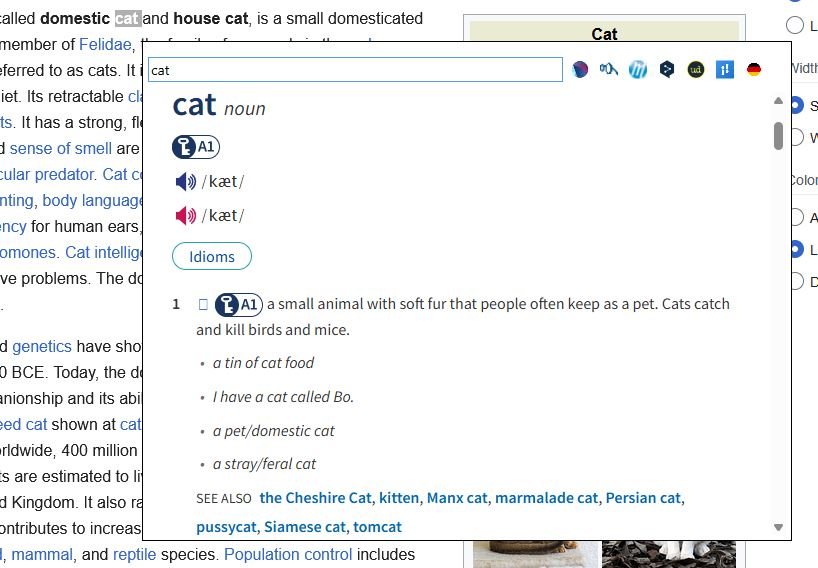

# Translator

[](https://github.com/neko-in-the-sky/Translator/actions/workflows/build.yml)
[](https://github.com/neko-in-the-sky/Translator/actions/workflows/release.yml)

A tray-resident pop-up dictionary for Windows. Copy a word, press <kbd>Ctrl</kbd>+<kbd>Space</kbd>,
and a small always-on-top window appears next to the cursor with that word already looked up.
Press <kbd>Esc</kbd> or click away and it disappears.



## Install

Download one of these from the latest [release](../../releases):

- **`Translator-<version>-win-x64-setup.exe`** (recommended) installs Translator for your user
  account only, so it needs no administrator rights. It adds Translator to the Start menu and to
  *Settings → Apps*. It can also add a desktop shortcut and start Translator when you sign in to
  Windows. To update, run the setup for the new version. It closes Translator if it's running and
  keeps your choices.
- **`Translator-<version>-win-x64.zip`** is the portable version. Unzip it anywhere and run
  `Translator.exe`.

Both use the same [settings](#settings) and [logs](#logs), and uninstalling keeps them.
Translator needs the Microsoft Edge WebView2 Runtime, which Windows 11 and up-to-date Windows 10
already have. If it's missing, the setup offers to open its download page.

The files aren't code-signed, so Windows SmartScreen may say it "protected your PC". Choose
**More info → Run anyway**.

## Usage

| Action | Result |
|---|---|
| <kbd>Ctrl</kbd>+<kbd>Space</kbd> | Look up the clipboard text at the cursor |
| <kbd>Enter</kbd> in the search box | Search with the default engine (see [Settings](#settings)) |
| <kbd>Esc</kbd>, or clicking away | Hide the window |
| Toolbar icons | Re-run the current query against that engine |
| Tray icon | Translate, open the install, settings or logs folder, or exit |

## How it works

1. A system-wide hotkey is registered with `RegisterHotKey`.
2. On press, the clipboard is read.
3. If a full-screen application is in the foreground, the pop-up is suppressed unless that
   application is allow-listed — so it stays out of the way during games and presentations.
4. The text is formatted into the default engine's URL and loaded in an embedded WebView2 control.
5. Ad and tracker requests are blocked, and a per-site script strips the page's own chrome so the
   pop-up shows the entry and little else.

If the copied text does not match the default engine's `AutoSearchRegex`, nothing is searched
automatically — a confirmation page appears instead, so a stray clipboard full of text never
turns into a web request on its own.

## Settings

Your settings live in `%APPDATA%\Translator\usersettings.json`. Updates never touch this file, so
whatever you set there survives every new release. Translator creates it on first run with a short
explanation inside. Right-click the tray icon and choose **Open settings folder** to find it.

Put in only what you want to change. Anything you leave out uses the default from the
`UserSettings` section of `appsettings.json` in the install folder:

```jsonc
{
  "DefaultSearchEngine": "Multitran",
  "Culture": "ru-RU",
  "AllowedFullscreenApps": ["firefox", "vlc"],
  "Popup": { "DefaultWidth": 800 }
}
```

| Setting | What it does |
|---|---|
| `DefaultSearchEngine` | Engine used by the hotkey and by <kbd>Enter</kbd>. Must match an engine's `Name`, or the first engine is used |
| `Culture` | UI language: `en-US` or `ru-RU` |
| `AllowedFullscreenApps` | Full-screen apps the pop-up may still appear over. An entry matches any process whose name contains it, ignoring case |
| `Popup` | `DefaultWidth`, `DefaultHeight` and `VerticalOffsetFromCursor`, in pixels. Set any subset |

- **A list replaces the default list.** The example above allows exactly `firefox` and `vlc`.
  `[]` allows none.
- **Only these four settings can be changed here.** Anything else in the file, such as
  `SearchEngines` or `Serilog`, is ignored, and a warning in the [log](#logs) names it. Search engines
  come with each release, together with the icons and page scripts they need.
- **Mistakes stop startup with an error.** Malformed JSON, or an unknown `Culture`, shows an error
  when Translator starts. For JSON errors, the message names the file. Comments and trailing
  commas are fine.

## Logs

Translator writes its logs to `%LOCALAPPDATA%\Translator\Logs`. Right-click the tray icon and
choose **Open logs folder** to find them. A new file starts each day, or sooner when a file reaches
10 MB. Only the newest 10 files are kept.

## Credits

- Icon: [Stack of books](https://www.flaticon.com/free-icon/stack-of-books_5832416) from Flaticon
- Blocklists: [The Block List Project](https://github.com/blocklistproject/Lists)
